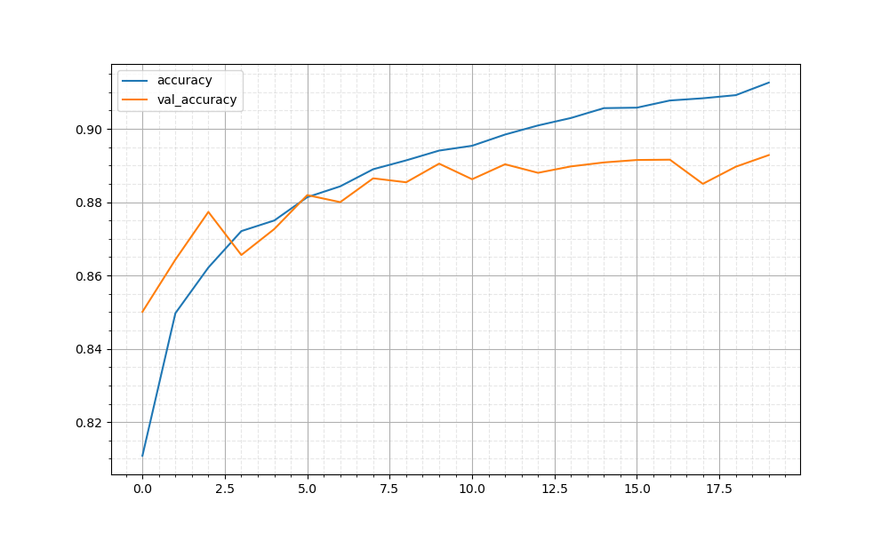
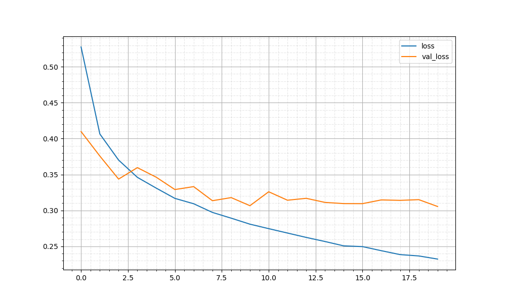

# PTMLib - Pendragon Tools for Machine Learning

## Summary

**PTMLib** is a set of utilities for use with Machine Learning frameworks such as Scikit-Learn and TensorFlow.

- **ptmlib.time.Stopwatch** - measure the time it takes to complete a long-running task, with an audio alert for task completion
- **ptmlib.cpu.CpuCount** - get info on CPUs available, with options to adjust/exclude based on a specific number/percentage.  Useful for setting `n_jobs` in Scikit-Learn tools that support multiple CPUs, such as `RandomForestClassifier`
- **ptmlib.charts** - render separate line charts for TensorFlow metrics such as accuracy and loss, with corresponding validation data if available
- **ptmlib.model_tools.load_or_fit_model()** - train, save, and reload TensorFlow models and metric charts automatically, making it easier to pick up where you left off

## ptmlib.time.Stopwatch

The `Stopwatch` class lets you measure the amount of time it takes to complete a long-running task. This can be useful for evaluating different machine learning models.

When `stop()` is called, an audio prompt will alert you that the task has completed. This helps when you are time constrained and multi-tasking while your code is executing, for example taking the [TensorFlow Developer Certificate](https://www.tensorflow.org/certificate) exam.

### Example:

```python
stopwatch = Stopwatch()

...

stopwatch.start()

history = model.fit(
    training_images,
    training_labels,
    validation_split=hp_validation_split,
    epochs=hp_epochs,
    callbacks=[early_callback]
)

stopwatch.stop()
```

### Output:

```
Start Time: Thu Jan 28 16:57:32 2021
Epoch 1/50
1500/1500 [==============================] - 2s 1ms/step - loss: 0.5316 - accuracy: 0.8086 - val_loss: 0.4141 - val_accuracy: 0.8503

...

1500/1500 [==============================] - 2s 1ms/step - loss: 0.2337 - accuracy: 0.9101 - val_loss: 0.3212 - val_accuracy: 0.8879
End Time:   Thu Jan 28 16:58:03 2021
Elapsed seconds: 30.8191 (0.51 minutes)
```

Start Time and End Time/Elapsed Seconds/Minutes are output when the `start()` and `stop()` methods are called, respectively.  All other information in the above example output will be generated based on your ML framework.  

Stopwatch has been tested using Scikit-Learn and TensorFlow, and can be used for any long-running Python code for which you want to measure execution time performance, or be notified of task completion.

Stopwatch has been tested with VS Code, PyCharm, Jupyter Notebook and [Google Colab](https://colab.research.google.com).

A default sound is provided for Google Colab, or you can specify your own:

```python
alert_audio_url: str = 'https://upload.wikimedia.org/wikipedia/commons/0/09/Do-Re-Tone.ogg'
stopwatch.stop(colab_sound_url=alert_audio_url)
```

## ptmlib.cpu.CpuCount

The CpuCount class provides information on the number of CPUs available on the host machine.  The exact number of *logical* CPUs is returned by the `total_count()` method.

Knowing your CPU count, you can programmatically set the number of processors used in Scikit-Learn tools that support the `n_jobs` parameter, such as `RandomForestClassifier` and `model_selection.cross_validate`.

In many cases (ex: a developer desktop), you will not want to use *all* your available processors for a task.  The `adjusted_count()` and `adjusted_count_by_percent()` methods allow you to specify the number and percentage of processors to exclude, with default exclusion values of `1` and `0.25`, respectively.  The *defaults* are reflected in the `print_stats()` output in the example below.

### Example:

```python
cpu_count = CpuCount()
cpu_count.print_stats()

max_cpu = cpu_count.adjusted_count(excluded_processors=2)

...

rnd_clf = RandomForestClassifier(
    n_estimators=hp_estimators, 
    random_state=hp_random_state, 
    n_jobs=max_cpu
)
```

### Output:
```
Total CPU Count:      16
Adjusted Count:       15
  By Percent:         12
  By 50 Percent:       8
```

While certain Scikit-Learn classifiers/tools benefit greatly from concurrent multi-CPU processing,  TensorFlow deep learning acceleration [requires a supported GPU](https://www.tensorflow.org/install/gpu) or [TPU](https://cloud.google.com/tpu).  As far as CPUs are concerned, TensorFlow handles this automatically; there is no benefit to using CpuCount here.

## ptmlib.charts.show_history_chart()

The `show_history_chart()` function renders separate line charts for TensorFlow training accuracy and loss, with corresponding validation data if available.  The `save_fig_enabled` parameter can be used to save a copy of the chart with a timestamped filename.  Charts options such as major and minor ticks are formatted to maximize readability for analysis during model development and troubleshooting.

### Example:

```python
import ptmlib.charts as pch

...

history = model.fit(
    training_images,
    training_labels,
    validation_split=hp_validation_split,
    epochs=hp_epochs,
    callbacks=[early_callback]
)

...

pch.show_history_chart(history, "accuracy", save_fig_enabled=True)
pch.show_history_chart(history, "loss", save_fig_enabled=True)
```

### Output:

TensorFlow History Accuracy Chart: *accuracy-20210201-111540.png*



TensorFlow History Loss Chart: *loss-20210201-111545.png*



The default file name format for these images is *searchstring-timestamp.png*.  The `file_name_suffix` parameter lets you replace the timestamp with another value, for more predictable filenames to simplify reuse of images in your code.

## ptmlib.model_tools.load_or_fit_model()

The `ptmlib.model_tools.load_or_fit_model()` function makes it easy to train and save a TensorFlow model for later use, in cases where you may need to stop and restart work in Jupyter or your IDE *after* model training has completed.  This can be very helpful when working through a long and detailed notebook with multiple example models, where some models take significant time to train.  You can avoid repeatedly training models you are satisfied with and have completed, and still close and reopen your notebook as needed.

### Example Usage:

```python
# from examples/computer_vision_caching.py

import ptmlib.model_tools as modt

...

model_file_name = "computer_vision_1"

...

fit_model_function_with_callback = lambda my_model, x, y, validation_data, epochs: my_model.fit(
    x, y, validation_data, epochs=epochs, callbacks=[early_callback], 
    validation_split=hp_validation_split)

# if this has previously been executed, we will load the trained/saved model 
model, history = modt.load_or_fit_model(model, model_file_name, x=training_images, y=training_labels,
    epochs=hp_epochs, fit_model_function=fit_model_function_with_callback, metrics=["accuracy"])

model.evaluate(test_images, test_labels)
```

### Example Output:

You will see output similar to the following if you re-run a previously saved notebook where `load_or_fit_model` was used.


If you wish to retrain a model that has previously been saved, simply delete the model file and related images, which are stored as `h5` and `png` files respectively.

### `fit_model_function` and `load_model_function`

Both `fit_model_function` and `load_model_function` are optional parameters that have default functions specified.  They can be set to custom functions to allow you more flexibility with your models.  A custom `fit_model_function` is in the example above.  You can also customize the `load_model_function` as in the following example:

```python
import tensorflow_hub as hub

model = keras.Sequential([
    hub.KerasLayer("https://tfhub.dev/google/tf2-preview/nnlm-en-dim50/1",
                  dtype=tf.string, input_shape=[], output_shape=[50]),
    keras.layers.Dense(128, activation="relu"),
    keras.layers.Dense(1, activation="sigmoid")
])

...
# must specify custom_objects to save model file
load_model_function_keras_layer = lambda model_file_name : keras.models.load_model(
    f'{model_file_name}.h5', custom_objects={'KerasLayer':hub.KerasLayer })

model, history = modt.load_or_fit_model(model, model_file_name, x=train_set, y=test_set, 
    epochs=hp_epochs, load_model_function=load_model_function_keras_layer, metrics=["accuracy"])
```

A detailed example of the `load_or_fit_model()` function is available in the [Computer Vision with Model Caching](ptmlib/notebooks/Computer-Vision-with-Model-Caching.ipynb) notebook.

## Installation

To install `ptmlib` in a virtualenv or conda environment:

```
pip install --no-index -f https://github.com/dreoporto/ptmlib/releases ptmlib
```

To install the `ptmlib` source code on your local machine:
```
git clone https://github.com/dreoporto/ptmlib.git
cd ptmlib

conda create -n ptmlib-dev python=3.8
conda activate ptmlib-dev
pip install -r requirements.txt
```
